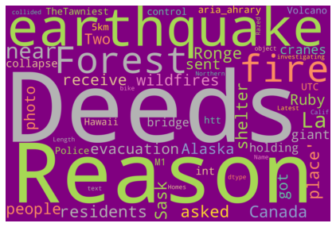
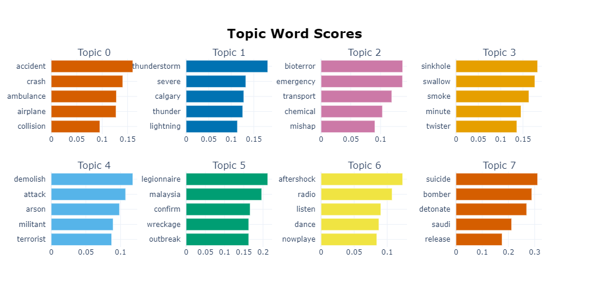

# NLP AND INSURANCE

Natural Language Processing will lead in the next years the revolution of the Artificial Intelligence for the Insurance industry.

There are several opportunities to employ NLP in the insurance activities, from Claims Processing to Fraud Detection and Chatbots.

In the marketing field, NLP can be used to monitor the sentiment analysis of feedback that people publish on different social networks to better consider insured needs or monitor the perception on a specific risk.

Textual analysis of claims and classification can simplify acceptance of claims in the process to reduce time treatment, operational errors or help in fraud detection.

Underwriting process can be improved by a better textual assessment. NLP can categorize patients diseases and retrieves the correlation between some symptoms and the likely cost of treatment for the Insurance Company.

The goal of this project is to show the Natural Language Processing applications in Insurance by disaster tweets data set from Kaggle. https://www.kaggle.com/c/nlp-getting-started 

Topics showed are:

### Exploratory Data Analysis:
  
    -Language Detection;
  
    -Length analysis;
  
    -Wordcloud

### Text Analysis:
  
    -Named Entity Recognition (NER) and Part of Speech Tagging (POS);
  
    -Text cleaning;
    
    -N-grams;
  
    -Topic Modelling with BertTopic;
  
    -Word embedding;
 
### Text Classification:
  
    -Classification with BERT
  

